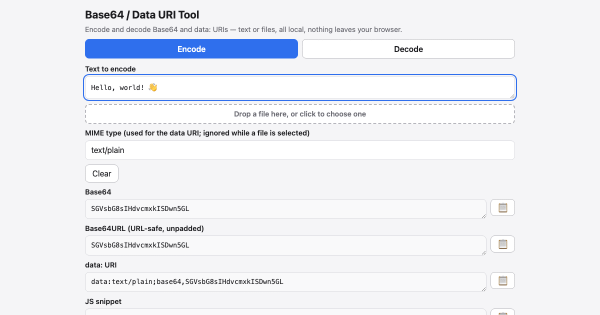

# claude-tools

A collection of small, single-file web tools that run entirely in your browser.



Try the tools yourself here: [https://www.codercowboy.com/demo/claude-tools/](https://www.codercowboy.com/demo/claude-tools/)

## Who it's for

Developers and designers who want quick, offline, no-signup utilities that run in the browser and never phone home.

If you'd rather have these as a CLI, a browser extension, or a polished hosted app with accounts and history, this isn't that. The [Alternatives](docs/alternatives.md) doc points you at tools that might fit better.

## The tools

| Tool | What it does |
| --- | --- |
| [ascii-art](src/tools/ascii-art/) | Turn an image into text art in four modes - ASCII ramp, Unicode half-block, Braille, and colored ANSI - and export as plain text, colored HTML, or ANSI. Everything runs in the browser through the canvas; nothing is uploaded. |
| [barcode-generator](src/tools/barcode-generator/) | Generate Code 128, EAN-13, UPC-A, and Code 39 barcodes with a live preview. Check digits are computed or verified, and the result exports as SVG or PNG. Nothing leaves the browser. |
| [base64-tool](src/tools/base64-tool/) | Base64 / data-URI encoder and decoder. Text or a file in; Base64, Base64URL, a `data:` URI, or a JS snippet out, and decode back. |
| [batch-watermark](src/tools/batch-watermark/) | Stamp a text or logo watermark on many images at once, preview it on one, and export the batch as a zip. Size, margin, and spacing are percentages of each image's short side, with a nine-point anchor grid, opacity, rotation, and tiling. Output is PNG, JPEG, or WebP, and nothing leaves the browser. |
| [color-converter](src/tools/color-converter/) | Batch-convert a pile of mixed `rgba()`/hex colors into one format. Paste them, see a swatch of each, copy them out. |
| [color-designer](src/tools/color-designer/) | Color-scheme generator from HSL harmonies, optionally flavored by a mood. Roll five schemes, expand into a live demo, copy them out. |
| [color-picker](src/tools/color-picker/) | Sample exact pixel colors out of an image. Load it, pan and zoom, eyedrop the pixel as `rgba()` and hex. |
| [cron-builder](src/tools/cron-builder/) | Build, parse, and understand a cron expression. Synced field pickers and raw editor, a plain-English explanation, and the next 5 fire times. |
| [diff-viewer](src/tools/diff-viewer/) | Visual diff of two texts. A hand-rolled Myers diff shows changes side-by-side or inline with word-level highlighting, plus a copyable unified diff. Nothing leaves the browser. |
| [dither-studio](src/tools/dither-studio/) | Reduce an image to a limited color palette with optional dithering and chunky pixels, compare against the original with a before/after wipe, and export a PNG, an indexed PNG-8, or the palette. Everything runs in the browser through the canvas; nothing is uploaded. |
| [format-converter](src/tools/format-converter/) | Convert a document between JSON, CSV, TSV, YAML, `.properties`, and XML, with auto-detect of the source format. Every parser and emitter is hand-rolled, and nothing you paste leaves the browser. |
| [hasher](src/tools/hasher/) | Hash text or a file - MD5, SHA-1, SHA-256, SHA-512, and CRC32 all at once, plus keyed HMAC, with optional Base64 output. Everything runs in the browser; nothing is uploaded. |
| [hat-picker](src/tools/hat-picker/) | Random picker for game night. Add entries, pull a winner from the hat with a slot-machine reveal and confetti, optionally removing each winner after the draw. |
| [http-headers](src/tools/http-headers/) | Explain, lint, and build HTTP headers. Paste a raw request or response and get each header explained and checked against a security checklist with ready-to-paste fixes, or build a recommended set as plain text or an nginx, Apache, or Express snippet. Nothing is sent anywhere. |
| [inflation-calculator](src/tools/inflation-calculator/) | What a US dollar amount from one year is worth in another, using bundled [BLS](https://www.bls.gov/cpi/) CPI-U annual data. |
| [invisible-chars](src/tools/invisible-chars/) | Detect, reveal, and strip invisible, zero-width, bidi, and look-alike Unicode in pasted text. Flagged characters become colored chips with a per-character inspector, and a clean step normalizes and removes chosen categories. Nothing leaves the browser. |
| [markdown-previewer](src/tools/markdown-previewer/) | Live Markdown previewer. Type Markdown on the left and see the rendered HTML on the right. The converter is hand-rolled, sanitizes links and raw HTML, and nothing you type leaves the browser. |
| [network-toolkit](src/tools/network-toolkit/) | Transfer-time math, CIDR/subnet math, IPv4/IPv6 conversion, and netmask ⇄ prefix. No DNS, no network calls. |
| [pretty-printer](src/tools/pretty-printer/) | Pretty-print or minify JSON, YAML, HTML, CSS, SQL, and JavaScript. Every formatter is hand-rolled in vanilla JS, and nothing you paste leaves the browser. |
| [qr-generator](src/tools/qr-generator/) | Generate a QR code from text or a URL with a QR encoder hand-rolled in vanilla JS. Download it as PNG or SVG. |
| [social-card-maker](src/tools/social-card-maker/) | Compose a social share image (Open Graph / Twitter card) from a title, subtitle, and solid, gradient, or photo background, with an optional logo. Export PNG, JPEG, or WebP and copy the matching meta tags. Everything runs in the browser through the canvas; nothing is uploaded. |
| [uuid-generator](src/tools/uuid-generator/) | Generate and inspect identifiers - UUID v4/v7, ULID, nanoid, and random tokens - bulk generate and copy, plus an inspector. |

The whole set also has a little landing gallery at [`src/gallery/index.html`](src/gallery/index.html).

## 60-second quickstart

Simply download this project's source code from github, and open [`src/gallery/index.html`](src/gallery/index.html) in your browser by double clicking on it in your file explorer (or `finder`), or drag it onto your browser window. If you have Node installed, `npx ct run` opens that gallery for you.

## Development

Want to rebuild the tools, run the tests, or use `claude-tools` as a baseline for your own project? You'll need [Node.js](https://nodejs.org) 20+. Everything runs through `ct`, the repo's small command runner, driven straight from a clone with `npx`.

```bash
# Clone and install - one root node_modules holds all the dev/test deps
git clone https://github.com/codercowboy/claude-tools.git
cd claude-tools
npm install
npx playwright install chromium   # the browser the e2e tests drive

# Then drive it with ct:
npx ct build [tool]   # assemble every tool's index.html (or just one) from source/
npx ct dist           # build, then assemble a deployable dist/ (gallery + one folder per tool)
npx ct test  [tool]   # run the whole suite (or one tool's unit + e2e)
npx ct serve [tool]   # serve a tool (or the whole gallery) at http://localhost:8080
npx ct run            # open the built gallery in your default browser
```

`npx ct` with no verb prints the menu. You only need `npx ct build` after editing a tool's `source/` - the committed `index.html` files are already built.

## Host it yourself

The built tools are static `index.html` files with everything inlined, so once you're happy with one you can drop it on any static host - GitHub Pages, an S3 bucket, Netlify, a folder on your own web server - and it'll run there the same way it runs from `file://`. Nothing to configure, no backend to stand up.

For the whole set at once, `npx ct dist` assembles a `dist/` folder - the gallery at `dist/index.html`, each tool under its own `dist/<tool>/` - that you can deploy as-is to a static host like GitHub Pages. It's a copy of the built files, so the source tree is left alone.

## Why it works

Each tool is authored in pieces under a `source/` folder and assembled by a small Node build (`scripts/build-tool.mjs`) into the single committed `index.html`. The result inlines all its own CSS and JS, so there's nothing to fetch at runtime and nothing to install to use it. There are zero packaged runtime dependencies - the only dev dependency is the test harness, and it never ships in the tool.

The full write-up - the build pipeline, the single root install, the shared includes, the two-layer testing, and the dependency breakdown and toolkit - lives in [Technical details](docs/technical.md).

## Alternatives

These aren't the only offline browser tools out there, and for some jobs a CLI or a purpose-built app beats a single HTML file. If one of these isn't your fit, the [Alternatives](docs/alternatives.md) doc names the closest analogs, the online tools they replace, and where to look when you want more.

## Credit

**Code & docs:** [Claude](https://www.anthropic.com/claude) (Anthropic). Full transparency, Claude wrote all of it.

**Concept & direction, the ideas guy:** [Jason Baker](https://github.com/codercowboy).

## License

[MIT](LICENSE) - it's a great license because it gets out of your way: use it however you want, commercial or not, just keep the notice. **My code should work, but I'm not liable if it goes sideways on you.**

Questions, comments, kudos, criticisms - all welcome.
— Coder Cowboy
