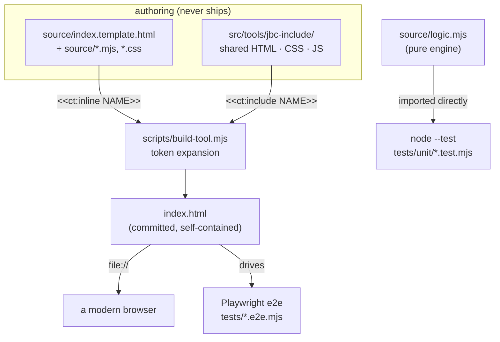
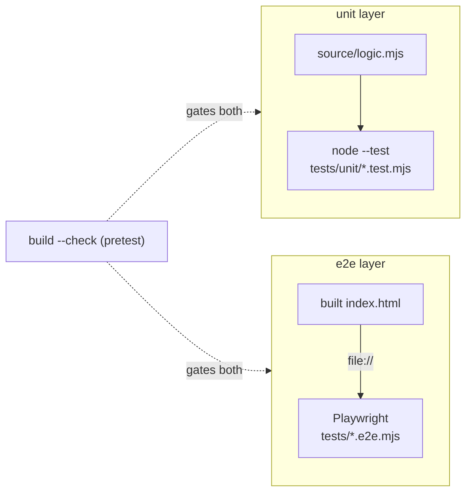

# claude-tools technical details

This is how claude-tools is actually put together, for anyone curious about the build and the plumbing rather than how to run it. To clone it and open a tool, the [README](../README.md) has the quickstart. This doc is about how the repo is shaped and why.

Claude (Anthropic) wrote nearly all of the code and docs. [Jason Baker](https://github.com/codercowboy) set the concept and direction. It's a portfolio of small, standalone web tools, not a framework. Depth here is kept proportionate to that. The build and test scaffolding around the tools is the part with any real machinery.

---

## The 10,000-foot view

claude-tools is a portfolio of single-file, [vanilla-JS](https://developer.mozilla.org/en-US/docs/Web/JavaScript) web tools. The shipped artifact for every tool is one self-contained `index.html` that opens straight from `file://` with no build step, no server, no [CDN](https://developer.mozilla.org/en-US/docs/Glossary/CDN), and no runtime dependencies. Everything else in the repo exists only to author, assemble, and test those files.

A tool that has outgrown comfortable hand-authoring is written under a `source/` folder and assembled back into one `index.html` by a shared, dependency-free build. Each tool is its own standalone [npm](https://www.npmjs.com/) package with its own `package.json` and its own `node_modules`, so the repo is not an npm workspace. Two shared directories hold the common pieces: `jbc-include/` for HTML/CSS/JS the build inlines into the shipped files, and `test-support/` for test helpers the tools import. Testing runs in two layers: fast [`node --test`](https://nodejs.org/api/test.html) unit tests against each tool's pure engine, and [Playwright](https://playwright.dev) end-to-end tests that drive the built `index.html` in a real browser.



The rest of this doc walks each piece: the build pipeline, the per-tool package model, the shared assets, the two test layers, and the dependency and toolkit breakdown.

---

## Components & roles

### The shipped `index.html`

The product. One self-contained file per tool, plus a landing-gallery `index.html` at `src/tools/`. It carries its own HTML, CSS, and JavaScript inline, runs entirely client-side, and works from `file://` or any static host. The nine tools are `base64-tool`, `color-converter`, `color-designer`, `color-picker`, `cron-builder`, `inflation-calculator`, `network-toolkit`, `qr-generator`, and `uuid-generator`.

### `source/` — the authoring form

A tool opts into the build by having `source/index.template.html`. Alongside it live the tool's own source files: a `logic.mjs` pure engine, an `app.mjs` that wires the engine to the DOM, `styles.css`, and so on. The template and its source files are what a maintainer edits. The committed `index.html` is generated from them.

### `scripts/` — the build and dev plumbing

Five small Node scripts, all dependency-free, run from the repo root:

| Script | Wired to | Does |
|---|---|---|
| `build-tool.mjs` | per-tool `npm run build` | assembles one tool's `index.html` from `source/`; also `--check` |
| `build-all.mjs` | root `npm run build` / `build:check` | discovers and builds every opted-in tool |
| `install-all.mjs` | root `postinstall` / `npm run install:all` | installs every sub-package's deps |
| `test-all.mjs` | root `npm run test:all` | runs every tool's e2e suite |
| `serve.mjs` | per-tool `npm run serve` | a tiny static server for one tool over `http://` |

### `jbc-include/` and `test-support/` — the shared pieces

`src/tools/jbc-include/` holds shared HTML/CSS/JS the build inlines into the shipped files. `src/tools/test-support/` holds dev-only test helpers the tools import. Neither is special-cased anywhere: the build resolves include tokens against `jbc-include/`, and the tools reach `test-support/` by a relative path. Both get their own sections below.

The design principle under all of it: the shipped `index.html` is the only thing that ships. `source/`, `scripts/`, `jbc-include/`, `test-support/`, `tests/`, and `node_modules/` are authoring and dev scaffolding, kept out of every tool's published `files` list.

---

## The build pipeline

The build is one shared, dependency-free script (`scripts/build-tool.mjs`) that expands tokens in a template into a single file. A template, and any source file it pulls in, may contain two tokens:

- `<<ct:include NAME>>` inlines a shared include from `src/tools/jbc-include/NAME` (for example `base.css`, `footer.html`, `copy.js`).
- `<<ct:inline NAME>>` inlines the tool's own source file `source/NAME` (for example `styles.css`, `app.mjs`, `logic.mjs`).

Expansion runs in repeated passes (capped at 20, which guards against a file that includes itself), so an inlined file may itself contain tokens. In `qr-generator`, for instance, the template inlines `app.mjs`, and `app.mjs` in turn holds `<<ct:inline logic.mjs>>` where the pure engine slots in. If any token is still unresolved after the cap, the build throws rather than emitting a half-built file.

```
  source/index.template.html
        │   <<ct:include base.css>>   ── from src/tools/jbc-include/
        │   <<ct:inline  styles.css>> ── from this tool's source/
        │   <<ct:inline  app.mjs>>    ── which itself holds <<ct:inline logic.mjs>>
        ▼   (expanded repeatedly, up to 20 passes)
     index.html   (banner inserted right after the doctype)
```

Every generated file gets a banner inserted immediately after the doctype, so it's clear the file is not meant to be hand-edited:

```html
<!doctype html>
<!-- GENERATED FILE — do not edit directly. Author in source/, then run: npm run build (see docs/conventions.md § Build-assembled tools) -->
```

`scripts/build-all.mjs` discovers what to build: it walks `src/tools/`, treats any directory that has `source/index.template.html` as a build target, and also builds the landing gallery at `src/tools/source/index.template.html`. All nine tools plus the gallery are build-assembled today. `npm run build` writes every `index.html`; `npm run build:check` (which passes `--check`) rebuilds in memory and exits non-zero if any committed `index.html` differs from what the current source produces. That check is how the repo keeps a committed file from drifting away from its source.

Include tokens resolve against `src/tools/jbc-include/`, the builder's `INCLUDE_DIR`. There's also a sibling `src/tools/include/` reserved for shared assets specific to claude-tools, but it's currently empty (a README only): every shared asset in use today came from [jason-code](https://github.com/codercowboy) and lives vendored in `jbc-include/`.

---

## Per-tool standalone packages

The repo is not an npm workspace. Each package under `src/tools/` is standalone. It has its own `package.json` and its own isolated `node_modules`. That keeps installs from racing each other and lets the tools be tested in parallel with their own playwright browser instances.

There's no ledger of packages to maintain. `scripts/install-all.mjs` (wired as the root `postinstall` and as `npm run install:all`) walks the whole repo, finds every `package.json` except the root's (skipping `node_modules/` and `.git/`), and runs `npm install` in each directory it finds. Adding a new tool with a `package.json` picks it up automatically.

```
  npm install  (at repo root)
        │  triggers postinstall → scripts/install-all.mjs
        ▼
   walk the repo, skip node_modules/ .git/ and the root
        ├── src/tools/base64-tool        → npm install
        ├── src/tools/color-converter    → npm install
        ├── …                            → npm install
        └── src/tools/uuid-generator     → npm install
```

Each tool's `package.json` also wires `npm run build`, `build:check`, `test`, `test:unit`, `test:e2e`, and `serve`, all pointing at the shared root scripts (`node ../../../scripts/build-tool.mjs`, and so on). For behavior that differs between `file://` and `http://` (some `fetch` or permission cases), `scripts/serve.mjs` gives each tool an `npm run serve` that serves its own directory over `http://localhost:8080` (or `$PORT`), with a path-traversal guard and no dependencies.

---

## Shared assets — `jbc-include` and `test-support`

### `jbc-include/` — inlined shared HTML/CSS/JS

These are the shared pieces the build pastes into shipped files. The current set: `base.css`, `controls.css`, `gallery.css`, `footer.html`, `confirm.js`, `copy.js`, `crc32.js`, `license.js`, `util.js`, and `readme-footer.md`. A tool pulls what it needs with `<<ct:include NAME>>`, and the build always inlines the current canonical file, so there's no manual paste-and-hash step to keep in sync.

### `test-support/` — imported dev-only test helpers

These are dev/test-only [ESM](https://developer.mozilla.org/en-US/docs/Web/JavaScript/Guide/Modules) helpers a tool's tests *import*. They're never inlined into a shipped `index.html` and never ship. `test-support/` sits one level above the tool directories, so a tool reaches it by a relative path from its `tests/` folder. What's there:

- `setup.mjs` — e2e navigation and first-load setup: `toolUrl()` resolves the built `index.html` as a `file://` URL, and `seedHelpSeen()` sets the help-seen flag before the page's own script runs so the Help popup doesn't open over assertions.
- `unit.mjs` — `loadLogic()`, a memoized dynamic import of the tool's `source/logic.mjs`, so unit tests import the pure engine directly.
- `shared-ui.mjs` — `assertLicenseModal()`, the shared footer License-modal contract every tool's e2e suite reuses.
- `playwright.base.config.mjs` — the base Playwright config, exported as a plain object (no `@playwright/test` import) so it resolves from this shared dir, which has no `node_modules` of its own. A tool spreads it into its own `defineConfig`, overriding only where it differs.

---

## Testing — two layers

### Unit — `node --test`, no browser

A build-assembled tool's pure, DOM-free engine lives in `source/logic.mjs`, the same file the shipped `index.html` inlines. Unit tests import that module directly through `test-support`'s `loadLogic()` and run under Node's built-in test runner. No browser, no DOM. Per tool: `npm run test:unit` runs `node --test tests/unit/*.test.mjs`. At the repo root, `npm test` is plain `node --test`, which discovers the tools' unit tests across the tree.

### End-to-end — Playwright over `file://`

E2E specs are named `*.e2e.mjs` (not Playwright's default `*.spec.*`), live in each tool's `tests/`, and drive the built `index.html` over a `file://` URL in a real browser. Per tool: `npm run test:e2e` runs `playwright test --config=tests/playwright.config.mjs`, where that config spreads the shared base and overrides only outliers (`qr-generator`, for example, runs serial with a longer timeout because its round-trip decode tests render to a real canvas). At the repo root, `npm run test:all` (`scripts/test-all.mjs`) discovers every package that has a `test:e2e` script and runs them sequentially. Running the e2e layer needs the deps installed (`npm run install:all`) and the Playwright browser (`npx playwright install chromium`).

Both `test:unit` and `test:e2e` have a `pretest` hook that runs `build --check` first, so a stale `index.html` fails the run before any test executes. The tests can't pass against a file that drifted from its source.



---

## Dependency breakdown

### Packaged (npm) dependencies: none ship

Every shipped tool has **zero runtime dependencies.** Each tool's `package.json` declares an empty `dependencies`, and its `files` list is only `index.html`, `README.md`, and `preview.png`. `source/`, `tests/`, and `node_modules/` never ship. The shipped `index.html` files carry no external `<script>` or `<link>` to any CDN. For a set of tools whose whole point is to run offline from a single file, no supply chain to audit is the property to want.

There are dev-only dependencies, and none of them ship:

- **[`@playwright/test`](https://playwright.dev)** — the e2e test runner, a `devDependency` of all nine tools.
- **[`jsqr`](https://github.com/cozmo/jsQR), [`pngjs`](https://github.com/pngjs/pngjs), [`qrcode`](https://github.com/soldair/node-qrcode)** — extra `devDependencies` of `qr-generator` only, used as reference oracles to check its hand-rolled QR encoder against known-good libraries in tests. They verify the tool, they're never part of it.

The root `package.json` has no runtime dependencies of its own. Its `optionalDependencies` (`@codercowboy/claude-tpm`, `jason-code`) are local dev-workspace tooling wired by `file:` path, not anything a tool uses.

### Hard platform / engine requirements

"No runtime deps" is not "no requirements." The foundational things, none of which are a packaged dependency:

- **A modern browser** — the only thing needed to *use* a built tool. The shipped `index.html` runs entirely client-side, from `file://` or any static host.
- **[Node.js](https://nodejs.org) 20 or newer** — needed only to build and test, not to use a tool. Both the root and every tool declare `engines.node >= 20`, and the build and test scripts use Node's standard library and its built-in test runner.
- **[npm](https://www.npmjs.com/)** — needed only to install the dev/test dependencies (`npm install`, which triggers `install:all`).

---

## Built with

The dev and authoring toolkit, distinct from the requirements above. These are the tools used to build claude-tools, not to run any of it:

- **[VS Code](https://code.visualstudio.com)** — the editor.
- **[Node.js](https://nodejs.org)** — the runtime the build and test scripts are written in. Tests are plain `node --test`, so there's no unit-test framework to install.
- **[Claude Code](https://claude.com/claude-code)** — Claude wrote nearly all of the code and docs through it.
- **[git](https://git-scm.com)** — version control.
- **[npm](https://www.npmjs.com/)** — per-tool packaging, the dev/test dependency install, and the script wiring.

---

> Cross-links: → [README](../README.md), → [Alternatives](alternatives.md). Last touched 2026-09-16.
