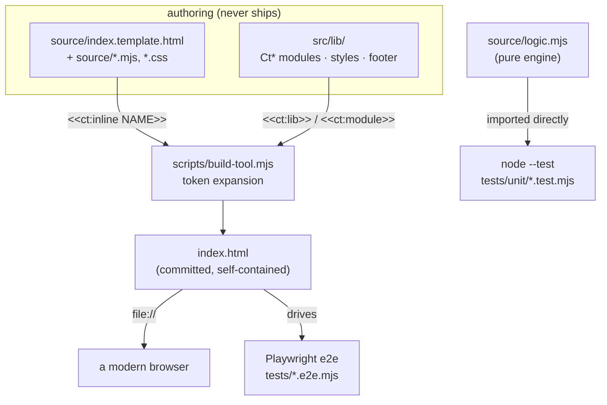
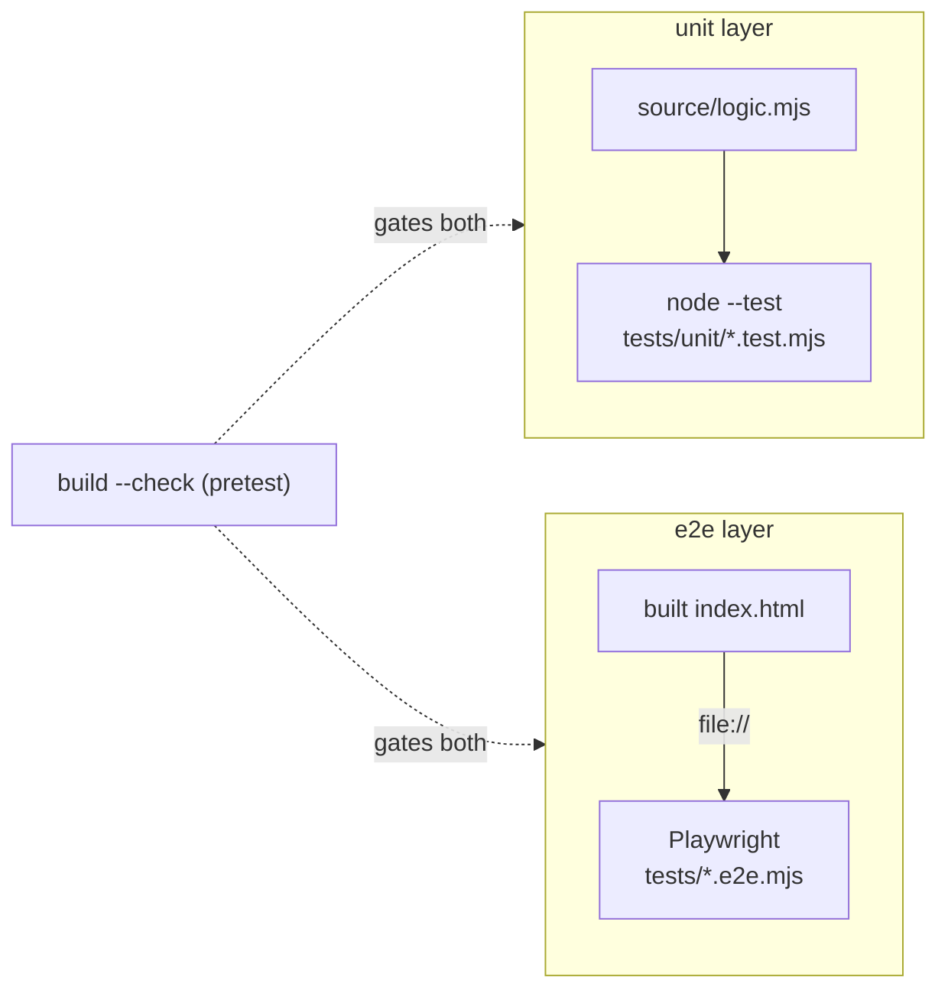

# claude-tools technical details

This is how claude-tools is actually put together, for anyone curious about the build and the plumbing rather than how to run it. To clone it and open a tool, the [README](../README.md) has the quickstart. This doc is about how the repo is shaped and why.

Claude (Anthropic) wrote nearly all of the code and docs. [Jason Baker](https://github.com/codercowboy) set the concept and direction. It's a portfolio of small, standalone web tools, not a framework. Depth here is kept proportionate to that. The build and test scaffolding around the tools is the part with any real machinery.

---

## The 10,000-foot view

claude-tools is a portfolio of single-file, [vanilla-JS](https://developer.mozilla.org/en-US/docs/Web/JavaScript) web tools. The shipped artifact for every tool is one self-contained `index.html` that opens straight from `file://` with no build step, no server, no [CDN](https://developer.mozilla.org/en-US/docs/Glossary/CDN), and no runtime dependencies. Everything else in the repo exists only to author, assemble, and test those files.

A tool that has outgrown comfortable hand-authoring is written under a `source/` folder and assembled back into one `index.html` by a shared, dependency-free build. The repo has a single [npm](https://www.npmjs.com/) `package.json`, at its root: the tools themselves carry no manifest, and the dev/test dependencies ([Playwright](https://playwright.dev) and a couple of test oracles) install once into one root `node_modules`. A shared library under `src/lib/` holds the common pieces: `Ct*`-prefixed ESM modules in `components/` and `utils/` that the build inlines into the shipped files, and test helpers in `src/lib/test-support/` that the tools import. Testing runs in two layers: fast [`node --test`](https://nodejs.org/api/test.html) unit tests against each tool's pure engine, and Playwright end-to-end tests that drive the built `index.html` in a real browser.



The rest of this doc walks each piece: the build pipeline, how the dependencies and dev scripts are wired, the shared assets, the two test layers, and the dependency and toolkit breakdown.

---

## Components & roles

### The shipped `index.html`

The product. One self-contained file per tool, plus a landing-gallery `index.html` at `src/gallery/`. It carries its own HTML, CSS, and JavaScript inline, runs entirely client-side, and works from `file://` or any static host. The twenty-two tools are `ascii-art`, `barcode-generator`, `base64-tool`, `batch-watermark`, `color-converter`, `color-designer`, `color-picker`, `cron-builder`, `diff-viewer`, `dither-studio`, `format-converter`, `hasher`, `hat-picker`, `http-headers`, `inflation-calculator`, `invisible-chars`, `markdown-previewer`, `network-toolkit`, `pretty-printer`, `qr-generator`, `social-card-maker`, and `uuid-generator`.

### `source/` — the authoring form

A tool opts into the build by having `source/index.template.html`. Alongside it live the tool's own source files: a `logic.mjs` pure engine, an `app.mjs` that wires the engine to the DOM, `styles.css`, and so on. The template and its source files are what a maintainer edits. The committed `index.html` is generated from them.

### `scripts/` — the build and dev plumbing

A handful of small Node scripts, all dependency-free, run from the repo root. `ct` (`scripts/ct.mjs`, exposed as the `ct` bin) is the front door that dispatches to the rest:

| Script | Wired to | Does |
|---|---|---|
| `build-tool.mjs` | `build-all.mjs`, per tool | assembles one tool's `index.html` from `source/`; also `--check` |
| `build-all.mjs` | `ct build` / root `npm run build` / `build:check` | discovers and builds every opted-in tool, or just the one(s) named |
| `test-all.mjs` | `ct test` / root `npm run test:all` | runs the `src/lib` unit tests + every tool's e2e suite, or one tool's unit + e2e |
| `serve.mjs` | `ct serve` / root `npm run serve` | a tiny static server for a tool (or any dir) over `http://` |

### `src/lib/` — the shared library

`src/lib/` holds the shared library. Its `components/` and `utils/` subdirectories hold the `Ct*`-prefixed ESM modules and the CSS/HTML the build inlines into the shipped files, and `src/lib/test-support/` holds dev-only test helpers the tools import. The build resolves `<<ct:lib>>` and `<<ct:module>>` tokens against `src/lib/`, and the tools reach `test-support/` by a relative path. Both get their own sections below.

The design principle under all of it: the shipped `index.html` is the only thing that ships. `source/`, `scripts/`, `src/lib/`, `tests/`, and `node_modules/` are authoring and dev scaffolding, not part of what a tool ships.

---

## The build pipeline

The build is one shared, dependency-free script (`scripts/build-tool.mjs`) that expands tokens in a template into a single file. A template, and any source file it pulls in, may contain these tokens:

- `<<ct:lib PATH>>` pastes a library file verbatim, PATH relative to `src/lib/` (for example `components/styles/base.css`, `components/footer.html`).
- `<<ct:module PATH>>` ESM-inlines a library module and its relative imports, PATH relative to `src/lib/` (for example `utils/CtUtil.mjs`, `components/CtLicense.mjs`). Each module becomes its own IIFE scope so top-level names never collide, and shared dependencies are inlined once.
- `<<ct:inline NAME>>` inlines the tool's own source file `source/NAME` (for example `styles.css`, `app.mjs`, `logic.mjs`), flattening any bare relative library imports it carries.

Expansion runs in repeated passes (capped at 20, which guards against a file that includes itself), so an inlined file may itself contain tokens. In `qr-generator`, for instance, the template inlines `app.mjs`, and `app.mjs` in turn holds `<<ct:inline logic.mjs>>` where the pure engine slots in. If any token is still unresolved after the cap, the build throws rather than emitting a half-built file.

```
  source/index.template.html
        │   <<ct:lib    components/styles/base.css>> ── from src/lib/
        │   <<ct:inline styles.css>>                 ── from this tool's source/
        │   <<ct:inline app.mjs>>                    ── which itself holds <<ct:inline logic.mjs>>
        ▼   (expanded repeatedly, up to 20 passes)
     index.html   (banner inserted right after the doctype)
```

Every generated file gets a banner inserted immediately after the doctype, so it's clear the file is not meant to be hand-edited:

```html
<!doctype html>
<!-- GENERATED FILE — do not edit directly. Author in source/, then run: npm run build (see docs/conventions.md § Build-assembled tools) -->
```

`scripts/build-all.mjs` discovers what to build: it walks `src/tools/`, treats any directory that has `source/index.template.html` as a build target, and also builds the landing gallery at `src/gallery/source/index.template.html`. All twenty-two tools plus the gallery are build-assembled today. `npm run build` writes every `index.html`; `npm run build:check` (which passes `--check`) rebuilds in memory and exits non-zero if any committed `index.html` differs from what the current source produces. That check is how the repo keeps a committed file from drifting away from its source.

Library tokens resolve against `src/lib/`, the builder's lib dir (overridable with `$JC_LIB_DIR`, so a consuming repo can pull the library from a different location than its tools). The legacy flat-include token `<<ct:include>>` is retired: the old include directory is gone, and tools use `<<ct:lib>>` / `<<ct:module>>` instead.

---

## The dist tree

The build writes each tool's `index.html` in place, beside its `source/`. `ct dist` (or `npm run dist`) runs that same build and then adds a copy step on top of it: it assembles a deployable `dist/` tree, with each tool's single-file `index.html` under its own subfolder and the landing gallery at the root.

```
  dist/
    index.html               <- the gallery (tool links rewritten to the dist layout)
    preview.png              <- the gallery's og:image
    color-picker/index.html
    qr-generator/index.html
    …                        (one subfolder per build-assembled tool)
```

`scripts/dist.mjs` is the copy step, and it builds nothing itself. It cleans `dist/`, discovers tools the same way the build does (a `source/index.template.html` under `src/tools/`), and copies each built `index.html` into `dist/<tool>/`. Source files are copied, never moved. The gallery's built links are `../tools/<tool>/index.html`; in `dist/` the gallery sits one level above the tool folders, so those are rewritten to `<tool>/index.html` as it's copied, which makes `dist/` a self-contained site you can drop on any static host. `dist/` is committed, and it's rebuilt whole on each run, so it always matches the current build.

---

## Dependencies and the dev scripts — one root install

The repo is not an npm workspace, and the tools aren't individual npm packages. There's one `package.json`, at the repo root. It declares the dev/test dependencies for the whole repo, and they install into a single root `node_modules`. A plain `npm install` at the root is the whole setup, plus `npx playwright install chromium` for the browser. Nothing is installed per tool.

```
  npm install  (at repo root)
        ▼
   one node_modules/ at the root
        ├── @playwright/test      (every tool's e2e suite resolves it from here)
        ├── jsqr · pngjs · qrcode (qr-generator's test oracles)
        └── …
```

A tool opts into the e2e layer just by having a `tests/playwright.config.mjs`. That config imports `@playwright/test`, which Node resolves from the root `node_modules` up the directory tree, so a tool needs no manifest of its own. `scripts/build-all.mjs` and `scripts/test-all.mjs` discover tools the same way, by walking `src/tools/`, so a new tool is picked up automatically with nothing to register.

The dev commands run through `ct`, or the matching root `npm` scripts, rather than per tool. `ct build [tool]` assembles every tool's `index.html` or just the named one. `ct test [tool]` runs the whole suite or a single tool's unit + e2e. `ct serve [tool]` serves a tool (or any directory) over `http://localhost:8080` (or `$PORT`), with a path-traversal guard and no dependencies, for the cases where behavior differs between `file://` and `http://`.

The single install has one consequence worth naming: Playwright runs one instance at a time. `test-all.mjs` runs the tools' suites in sequence, and each suite already uses a single worker. Running several tools' browsers in parallel against separate isolated installs isn't possible anymore; in practice the suite runs one tool at a time regardless.

---

## Shared assets — `src/lib`

### `components/` and `utils/` — the inlined library

These are the shared pieces the build pastes into shipped files. `components/` carries the UI library: `Ct*` ESM modules (`CtClipboardUtil`, `CtComponents`, `CtConfirm`, `CtLicense`, `CtModal`), the `footer.html` partial, and the `styles/` CSS (`base.css`, `controls.css`, `gallery.css`, `widgets.css`). `utils/` carries the logic library: `CtByteUtil`, `CtDateTimeUtil`, `CtUtil`, `CtZipUtil`, plus the `formats/` and `image/` submodules. A tool pulls what it needs with `<<ct:lib>>` for a verbatim CSS/HTML file or `<<ct:module>>` for an ESM module, and the build always inlines the current canonical file, so there's no manual paste-and-hash step to keep in sync.

### `test-support/` — imported dev-only test helpers

These are dev/test-only [ESM](https://developer.mozilla.org/en-US/docs/Web/JavaScript/Guide/Modules) helpers a tool's tests *import*. They're never inlined into a shipped `index.html` and never ship. `test-support/` lives under `src/lib/`, so a tool reaches it by a relative path from its `tests/` folder (for example `../../../lib/test-support/setup.mjs`). The core ones:

- `setup.mjs` — e2e navigation and first-load setup: `toolUrl()` resolves the built `index.html` as a `file://` URL, and `seedHelpSeen()` sets the help-seen flag before the page's own script runs so the Help popup doesn't open over assertions.
- `unit.mjs` — `loadLogic()`, a memoized dynamic import of the tool's `source/logic.mjs`, so unit tests import the pure engine directly.
- `shared-ui.mjs` — `assertLicenseModal()`, the shared footer License-modal contract every tool's e2e suite reuses.
- `playwright.base.config.mjs` — the base Playwright config, exported as a plain object (no `@playwright/test` import), so the shared dir needs no imports of its own. A tool spreads it into its own `defineConfig`, which imports `@playwright/test` (resolved from the root `node_modules`) and overrides only where it differs.

Alongside these sit focused assertion helpers the e2e suites share where they need them: `storage.mjs` (localStorage), `clipboard.mjs` (copy-button stubs and reads), `layout.mjs` (overflow checks), `interaction.mjs` (modal a11y, drop dispatch), `files.mjs` (file upload), and `binary.mjs`.

---

## Testing — two layers

### Unit — `node --test`, no browser

A build-assembled tool's pure, DOM-free engine lives in `source/logic.mjs`, the same file the shipped `index.html` inlines. Unit tests import that module directly through `test-support`'s `loadLogic()` and run under Node's built-in test runner. No browser, no DOM. `ct test <tool>` runs that tool's unit layer (`node --test` over its `tests/unit/`) ahead of its e2e; the repo-wide `ct test` runs the `src/lib` unit suite plus every tool's e2e. At the repo root, `npm test` is plain `node --test`, which discovers unit tests across the whole tree.

### End-to-end — Playwright over `file://`

E2E specs are named `*.e2e.mjs` (not Playwright's default `*.spec.*`), live in each tool's `tests/`, and drive the built `index.html` over a `file://` URL in a real browser. Each tool's `tests/playwright.config.mjs` spreads the shared base and overrides only outliers (`qr-generator`, for example, runs serial with a longer timeout because its round-trip decode tests render to a real canvas). `scripts/test-all.mjs` discovers every tool that has a `tests/playwright.config.mjs` and runs `npx playwright test --config=…` for each, from the repo root, in sequence; `ct test <tool>` runs one tool's suite the same way. Running the e2e layer needs the root deps installed (`npm install`) and the Playwright browser (`npx playwright install chromium`).

Before it runs a tool's tests, `test-all.mjs` rebuilds that tool in `--check` mode, so a stale `index.html` fails the run before any test executes. The tests can't pass against a file that drifted from its source.



---

## Dependency breakdown

### Packaged (npm) dependencies: none ship

Every shipped tool has **zero runtime dependencies.** The shipped artifact is a single `index.html`, alongside its `README.md` and `preview.png`; the authoring scaffolding (`source/`, `tests/`, `node_modules/`) never ships. The `index.html` files carry no external `<script>` or `<link>` to any CDN. For a set of tools whose whole point is to run offline from a single file, no supply chain to audit is the property to want.

The dev-only dependencies all live in the root `package.json`, and none of them ship:

- **[`@playwright/test`](https://playwright.dev)** — the e2e test runner. One root `devDependency`; every tool's e2e suite resolves it from the root `node_modules`.
- **[`jsqr`](https://github.com/cozmo/jsQR), [`pngjs`](https://github.com/pngjs/pngjs), [`qrcode`](https://github.com/soldair/node-qrcode)** — reference oracles used only by `qr-generator`'s tests, to check its hand-rolled QR encoder against known-good libraries. They verify the tool, they're never part of it.

The root `package.json` carries those dev/test deps but no runtime dependencies of its own. Its `optionalDependencies` (`@codercowboy/claude-tpm`, `jason-code`) are local dev-workspace tooling wired by `file:` path, not anything a tool uses.

### Hard platform / engine requirements

"No runtime deps" is not "no requirements." The foundational things, none of which are a packaged dependency:

- **A modern browser** — the only thing needed to *use* a built tool. The shipped `index.html` runs entirely client-side, from `file://` or any static host.
- **[Node.js](https://nodejs.org) 20 or newer** — needed only to build and test, not to use a tool. The root `package.json` declares `engines.node >= 20`, and the build and test scripts use Node's standard library and its built-in test runner.
- **[npm](https://www.npmjs.com/)** — needed only to install the dev/test dependencies (`npm install` at the repo root).

---

## Built with

The dev and authoring toolkit, distinct from the requirements above. These are the tools used to build claude-tools, not to run any of it:

- **[VS Code](https://code.visualstudio.com)** — the editor.
- **[Node.js](https://nodejs.org)** — the runtime the build and test scripts are written in. Tests are plain `node --test`, so there's no unit-test framework to install.
- **[Claude Code](https://claude.com/claude-code)** — Claude wrote nearly all of the code and docs through it.
- **[git](https://git-scm.com)** — version control.
- **[npm](https://www.npmjs.com/)** — the dev/test dependency install and the script wiring.

---

> Cross-links: → [README](../README.md), → [Alternatives](alternatives.md). Last touched 2026-10-04.
